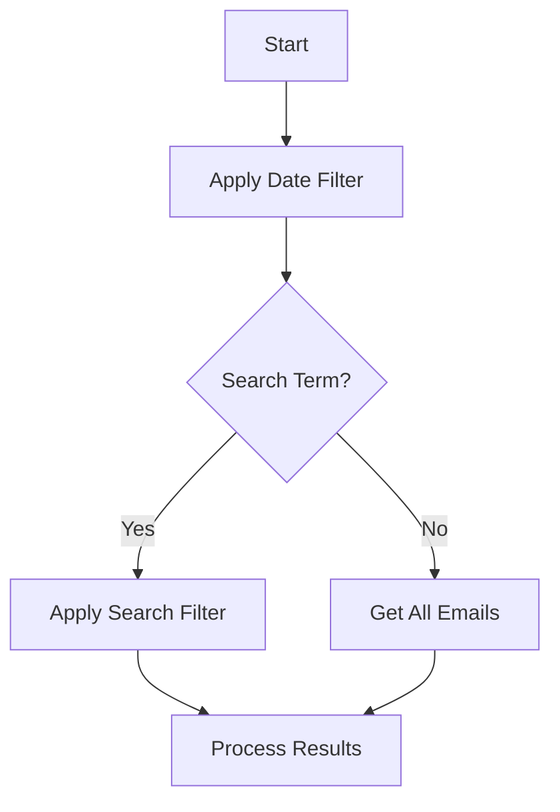
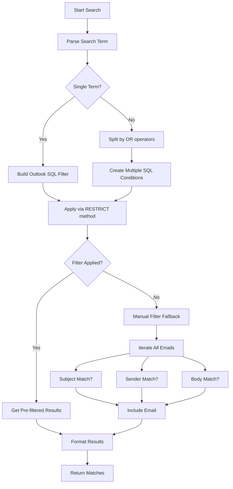

# Outlook MCP Server - Email Finding Logic

## Overview
The email finding functionality in the Outlook MCP Server is primarily handled by the `get_emails_from_folder()` function, with public interfaces provided through `list_recent_emails()` and `search_emails()` tools.

## Core Components

### 1. `get_emails_from_folder(folder, days, search_term=None)`
Main function that retrieves and processes emails from a specified Outlook folder.

**Parameters:**
- `folder`: Outlook folder object
- `days`: Number of days to look back (max 30)
- `search_term`: Optional keyword/contact to search for

### 2. Filtering Logic


#### Date Filtering
- Calculates threshold date:
```python
now = datetime.datetime.now()
threshold_date = now - datetime.timedelta(days=days)
```
- Skips emails older than threshold

#### Search Filtering
Two approaches:
1. **SQL Filtering (Preferred)**
- Uses Outlook's RESTRICT method
- Searches subject, sender name and body
- Supports both AND and OR operators (controlled by match_all parameter)
- Handles quoted phrases as single terms (e.g., "project x")
- Splits terms by spaces outside quotes

2. **Manual Filtering (Fallback)**
- Python-level string matching
- Case-insensitive search
- Supports both AND and OR logic (controlled by match_all parameter)
- Handles quoted phrases and splits terms by spaces outside quotes

### 3. Email Processing Pipeline
1. Sort emails by received time (newest first)
2. Apply date filter
3. Apply search filter (if provided)
4. Format each email using `format_email()`
5. Cache results in `email_cache` dictionary

## Search Term Processing

Outlook provides a SQL-like filtering capability through its RESTRICT method, which is more efficient than manual filtering. The system first attempts this optimized path before falling back to manual processing.



### Why SQL-like Filtering?
1. **Outlook's Native Capability**: Uses MAPI properties with SQL-like syntax
2. **Performance**: Server-side filtering reduces data transfer
3. **Precision**: Exact field matching using property URNs
4. **Syntax**: `@SQL=` prefix with Outlook-specific field names

### Search Fields (MAPI Properties):
- Supports OR operators (e.g., "meeting OR conference")
- Case-insensitive matching
- Partial word matching (e.g., "dev" matches "developer")
- Multiple terms are OR'ed together by default

## Public Interfaces

### `list_recent_emails(days=7, folder_name=None)`
- Gets recent emails from specified folder (default: Inbox)
- Returns count and instructions to view

### `search_emails(search_term, days=7, folder_name=None, match_all=False)`
   - Searches emails by keyword/contact
   - Supports quoted phrases (e.g., "project x")
   - Splits terms by spaces outside quotes
   - match_all=True requires ALL terms to match (AND logic)
   - match_all=False matches ANY term (OR logic, default)
   - Returns matching emails count and view instructions

## Caching Mechanism
- All found emails are cached in `email_cache` dictionary
- Keys are sequential numbers (1-based)
- Values are formatted email dictionaries
- Cache is cleared before new searches

## Email Format
Each email is formatted as a dictionary with:
- Basic metadata (subject, sender, date)
- Recipients list
- Body content
- Attachment info
- Status flags (read/unread, importance)

## Example Usage Flow
1. User calls `list_recent_emails(days=5)`
2. System retrieves emails from last 5 days
3. Results are cached and paginated
4. User views emails via `view_email_cache()`