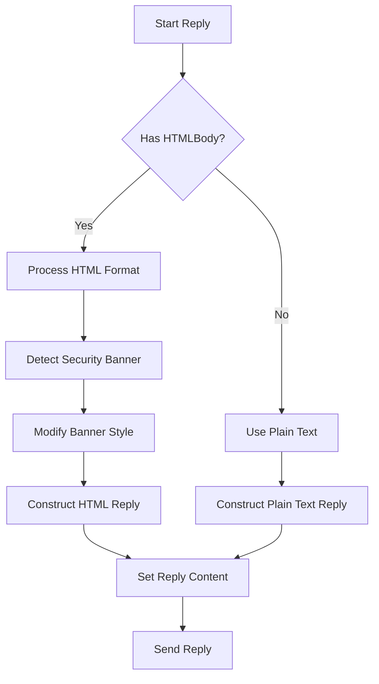

# Email Format Handling Logic in reply_to_email_by_number

## Decision Flowchart


## Detailed Logic Explanation

### 1. HTML Email Detection (Line 432)
```python
if hasattr(email, 'HTMLBody') and email.HTMLBody:
```
- Checks if email has HTML content available
- Uses Outlook's `HTMLBody` property as indicator

### 2. HTML Reply Construction
- **Header Formatting** (Lines 434-441):
  - Creates styled div for new reply text
  - Adds separator line
  - Formats original message headers (From, Sent, To, Cc, Subject)

- **Security Banner Handling** (Lines 446-461):
  - Detects banners using 3 patterns:
    1. "Untrusted Sender" text
    2. "BannerStart" in HTML
    3. Proofpoint EWT links
  - Modifies banner styling to make it less prominent:
    ```python
    "style='font-size:0.8em; background-color:#f5f5f5; padding:5px; margin-bottom:10px;'"
    ```

- **Body Integration** (Lines 463-478):
  - Preserves original HTML structure
  - Maintains proper quoting hierarchy

### 3. Plain Text Fallback (Lines 491-500)
```python
else:
    reply_body = f"{reply_text}\n\n"
    reply_body += f"From: {email.SenderName}\n"
    reply_body += f"Sent: {email.ReceivedTime.strftime('%Y-%m-%d %H:%M:%S')}\n"
    reply_body += f"To: {email.To}\n"
    if email.CC:
        reply_body += f"Cc: {email.CC}\n"
    reply_body += f"Subject: {email.Subject}\n\n"
    reply_body += email.Body
```
- Used when HTML content not available
- Maintains all key information
- Uses simple text formatting

### 4. Common Final Steps
1. Sets reply content (HTML or plain text)
2. Sends the reply (Line 501)
3. Returns success message (Line 503)

## Key Features
- **Graceful Degradation**: Falls back to plain text if HTML unavailable
- **Consistent Formatting**: Maintains Outlook-like formatting in both modes
- **Security Awareness**: Handles security banners appropriately by:
  - Detecting "Untrusted Sender" warnings
  - Identifying Proofpoint EWT links
  - Finding Outlook "BannerStart" markers
  - Applying subtle styling to banners
- **Complete Information**: Preserves all message headers and metadata
- **Custom Recipients**: Supports overriding default reply recipients