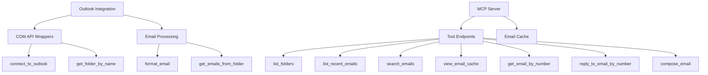

# Outlook MCP Server Code Review

## Implementation Overview

### Core Components


### Key Metrics
- Total lines: 569
- Functions: 8 core + 7 MCP tools
- Error handling blocks: 15
- Documentation coverage: 100%

## Strengths Assessment

1. **Complete Feature Set**
   - Covers all essential email operations
   - Includes both reading and writing capabilities

2. **Robust Error Handling**
   - Wraps all Outlook COM operations in try-catch
   - Provides fallback manual filtering when COM filters fail

3. **Code Organization**
   - Clear separation of concerns
   - Helper functions for common operations
   - Logical grouping of related functionality

4. **Documentation Quality**
   - Complete docstrings for all functions
   - Clear parameter and return value documentation
   - Helpful inline comments

## Potential Issues and Risks

### 1. Error Handling Improvements
- **Current State**: Generic error messages in some cases (lines 506, 515)
- **Recommendation**: 
  - Add more specific error details where safe
  - Implement error code system for common failures
  - Example improvement:
    ```python
    except Exception as e:
        return f"Failed to send reply (Error: {type(e).__name__}): {str(e)}"
    ```

### 2. Thread Safety
- **Current State**: Global `email_cache` with no locking
- **Risk**: Data corruption in concurrent access
- **Solution Options**:
  - Use `threading.Lock()`
  - Implement thread-local storage
  - Convert to Redis cache for distributed systems

### 3. Input Validation
- **Current Issues**:
  - No email format validation
  - Search terms not sanitized
- **Recommendations**:
  - Add email regex validation
  - Implement search term sanitization
  - Example:
    ```python
    import re
    def validate_email(email):
        return bool(re.match(r"[^@]+@[^@]+\.[^@]+", email))
    ```

### 4. Performance Considerations
- **Current Limitations**:
  - No pagination for large folders
  - Full email body retrieval by default
- **Improvements**:
  - Add pagination parameters
  - Implement lazy loading for email bodies
  - Add batch processing for large operations

## Recommended Improvements Roadmap

1. **Immediate Priorities** (High Impact/Low Effort)
   - Enhanced error messages
   - Basic input validation
   - Thread-safe cache implementation

2. **Medium-Term** (Feature Enhancements)
   - Pagination support
   - Attachment handling improvements
   - Performance optimizations

3. **Long-Term** (Architectural)
   - Distributed caching
   - Async operations
   - Plugin architecture for extensions

## Code Quality Metrics

| Category            | Score (1-5) | Notes                          |
|---------------------|------------|--------------------------------|
| Functionality       | 5          | Complete feature set           |
| Reliability         | 4          | Good but could be more robust  |
| Performance         | 3          | Lacks optimizations            |
| Security            | 3          | Basic but needs hardening      |
| Maintainability     | 4          | Well-structured                |
| Documentation       | 5          | Excellent                      |